<div align="center">

<!-- Animated Hero Banner -->


<!-- Dynamic Typing SVG -->
[](https://git.io/typing-svg)

<p>
  <a href="https://linkedin.com/in/rishabhtcodes"></a>&nbsp;
  <a href="https://rishabhtcodes.vercel.app/"></a>&nbsp;
  <a href="mailto:rishabhtiwari3538@gmail.com"></a>&nbsp;
  <a href="https://github.com/rishabhtcodes"></a>&nbsp;
</p>

</div>

## 🧑‍💻 About Me

```python
class RishabhKumarTiwari:
    def __init__(self):
        self.name = "Rishabh Kumar Tiwari"
        self.role = "Full Stack Engineer"
        self.website = "www.rishabhtcodes.tech"
        self.education = "B.Tech CSE @ Lovely Professional University"
        self.location = "Jalandhar, Punjab, India 🇮🇳"
        self.languages = ["C", "C++", "Python", "Java", "JavaScript", "PHP"]
        self.frameworks = ["React + Vite", "Node.js", "Django", "Tailwind CSS"]
        self.databases = ["MySQL", "MongoDB"]
        self.interests = ["Full Stack Dev", "REST APIs", "Cloud Technologies"]
        self.currently_learning = ["React + Vite", "Cloud Deployments", "CI/CD Pipelines"]
    
    def say_hi(self):
        print("Thanks for dropping by! Let's build something awesome together 🚀")

me = RishabhKumarTiwari()
me.say_hi()
```
<!--
- 🎓 Pursuing **B.Tech in Computer Science & Engineering** at **Lovely Professional University** (CGPA: 7.10)
- 🔭 I'm currently working on **Full Stack Web Applications** with **Django & React + Vite**
- 🌱 Constantly learning & improving my skills in **React, Cloud Deployments & CI/CD**
- 🏆 **Top 10** in Hack-Verse & **Rank 4** in Concoction — Intra-University Hackathons
- 💼 Open to **collaborations** and **freelance opportunities**
- 📫 Reach me at **rishabhtiwari3538@gmail.com**

-->


## 🛠️ Tech Stack

<div align="center">

### 💻 Languages


### 🚀 Frameworks & Libraries


### 🗄️ Databases & Tools


</div>


## 📊 GitHub Stats

<div align="center">


<br/>


</div>


<!--

## 🏆 GitHub Trophies

<div align="center">
  
</div>

 

-->

## 🔥 Featured Projects

<div align="center">

| Project | Description | Tech |
|---------|-------------|------|
| [🚀 Professional Portfolio](https://portfolio-cyan-chi-94.vercel.app) | Modern full-stack portfolio website showcasing projects, skills, and certifications |   |
| [🔒 Password Strength Detector](https://password-strength-detector-1.vercel.app) | A tool to analyze and evaluate the strength of passwords securely |   |
| [📋 Project Management System](https://github.com/rishabhtcodes/Project_Management_System) | Task and project management system |  |
| [📧 Mailing Web App](https://github.com/rishabhtcodes/Mailing-Web-App) | A customizable web frontend for mailing services |  |
| [🌾 Crop Disease Prediction](https://github.com/rishabhtcodes) | Rule-driven crop analysis using 2D arrays to evaluate temperature-humidity conditions & flag disease risks |   |
| [📅 Study Timetable Generator](https://github.com/rishabhtcodes) | Dynamic scheduling engine generating weekly study plans with weighted randomization & adaptive timetables |   |
| [🛒 Lovely Kart E-Commerce](https://lovelycart.vercel.app/) | Seamless shopping experience with product browsing, cart management & responsive design |     |
| [✅ Todo List](https://github.com/rishabhtcodes/Todo_list) | Task management app with add, update, delete & clean responsive interface |   |
| [� Django REST APIs](https://github.com/rishabhtcodes/Django_Rest_Api-s) | REST API implementations demonstrating different data sending patterns |   |
| [💼 Udyog Saarthi](https://github.com/rishabhtcodes/Udyog_Saarthi) | Career guidance platform |  |
| [🔄 Django CI/CD](https://github.com/rishabhtcodes/djangocicd) | CI/CD pipeline implementation for Django projects |  |

</div>


## 🎓 Education

<div align="center">

| | Details |
|---|---|
| 🏫 **Lovely Professional University** | B.Tech in Computer Science & Engineering • CGPA: 7.10 |
| 📍 Location | Phagwara, Punjab |

</div>


<!--

## 📜 Certifications

<div align="center">

| Certificate | Issuer |
|-------------|--------|
| Mastering C++: OOP to Dynamic Programming | Lovely Professional University |
| Built Generative AI Apps with No-Code Tools | Udemy |
| Master Generative AI & GenAI Tools (ChatGPT & more) | Udemy |
| The Bits and Bytes of Computer Networking | Google (Coursera) |
| Introduction to Hardware and Operating Systems | IBM (Coursera) |

</div>


-->


## 🏅 Achievements

<div align="center">

🥇 **Top 10** — *Hack-Verse* Intra-University Hackathon (Mar 2024)

🥈 **Rank 4** — *Concoction* Tech Fusion Hackathon (Mar 2024)

🤝 Contributed to **"Chhalaang" NGO** — enhancing education for rural children (Jun 2024)

</div>


## � Dev Quote of the Day

<div align="center">
  
</div>


## � Activity Graph

<div align="center">
  
</div>


<div align="center">

<!-- Animated Footer CTA -->


<br/>


</div>
